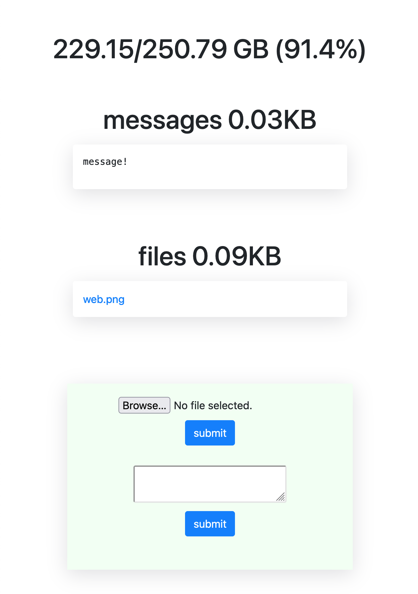

# server

Flask-based server for file upload/download and messages.



## Usage

```sh
cd services/web
```

First, install requirements with `pip install -r requirements.txt` 

`python3 app.py` will run on port `5000`

## Docker for local development

Uses Flask development server.

1. Update the environment variables in the _docker-compose.yml_ and _.env.dev_ files.
2. Build the images and run the containers:

    ```sh
    docker-compose up -d --build
    ```

3. Navigate to http://localhost:5000/ to view the web application.
   The "web" folder is mounted into the container and your code changes apply automatically.

> **Note**  
> Check for errors in the logs if this doesn't work via `docker-compose logs -f`.

### Teardown

Bring down the development containers (and the associated volumes with the `-v` flag):

```sh
docker-compose down -v
```

## Docker for production

Uses Gunicorn + nginx.

1. Update the environment variables in the _docker-compose.prod.yml_ and _.env.prod_ files.
2. Build the production images and spin up the containers:

    ```sh
    docker-compose -f docker-compose.prod.yml up -d --build
    ```

3. Ensure the app is up and running at http://localhost:1337.
   The "web/uploads" folder is mounted. To apply source code changes, the image must be re-built.

> **Note**  
> Again, if the container fails to start, check for errors in the logs via `docker-compose -f docker-compose.prod.yml logs -f`.

## Features

* File upload/download
* Click to copy messages
* Display available storage
* Consistent text formatting (useful for code snippets)
